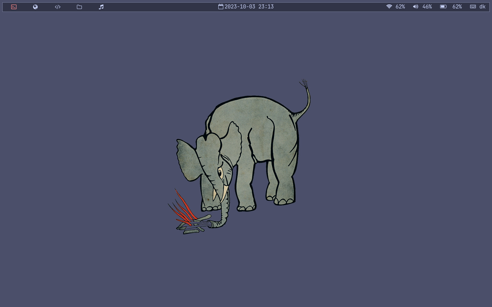
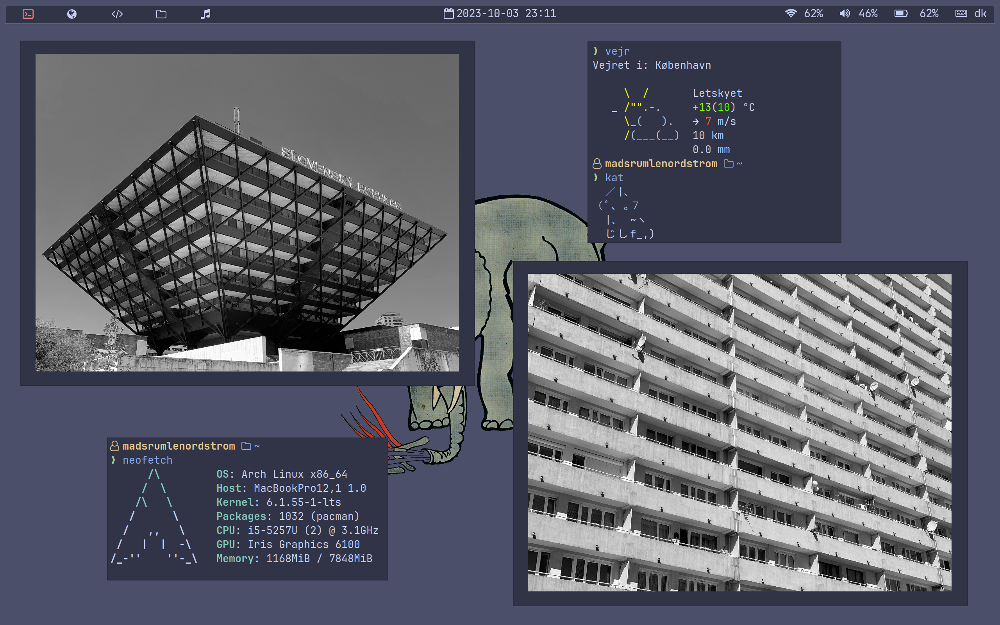
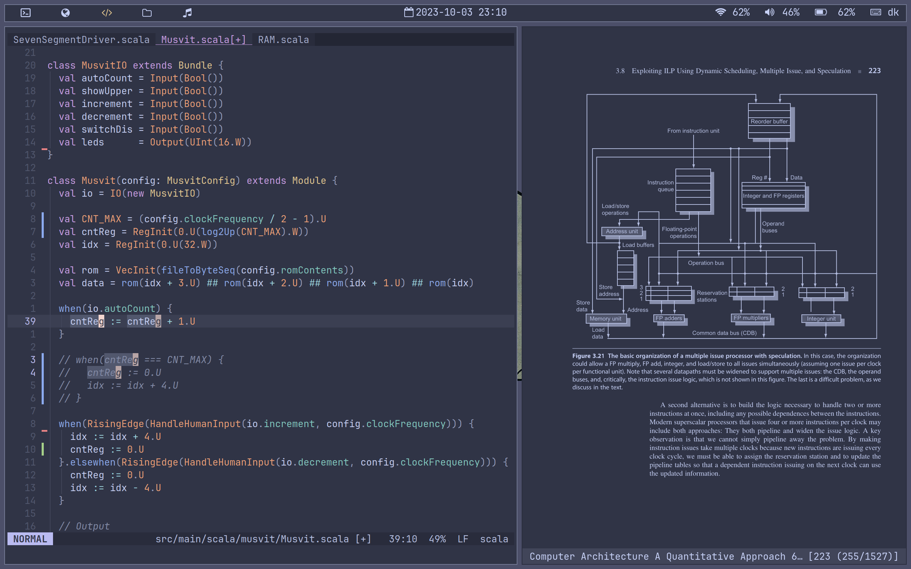
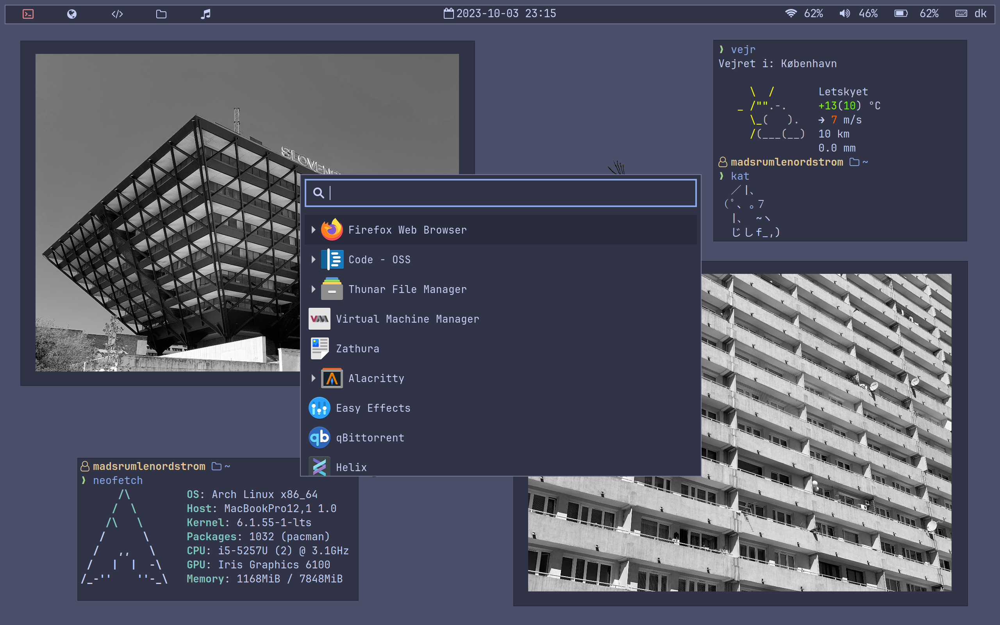

# Configuration files for my Linux setup
This repository contains various configuration files for my current Linux setup.
Feel free to takes inspiration from this setup.
This setup uses:

- Terminal: [alacritty](https://github.com/alacritty/alacritty)
- Window manager: [sway](https://github.com/swaywm/sway)
- Status bar: [Waybar](https://github.com/Alexays/Waybar)
- Launcher: [wofi](https://hg.sr.ht/~scoopta/wofi)
- Shell: [fish](https://github.com/fish-shell/fish-shell)
- Prompt: [starship](https://github.com/starship/starship)
- Editor: [helix](https://github.com/helix-editor/helix)
- Font: [JetBrainsMono Nerd Font](https://github.com/ryanoasis/nerd-fonts)
- Notification-daemon: [dunst](https://github.com/dunst-project/dunst)
- Color theme: [Catppuccin Frappe](https://github.com/catppuccin/catppuccin/)
- Icon theme [Papirus Dark](https://github.com/PapirusDevelopmentTeam/papirus-icon-theme)

## Screenshots

